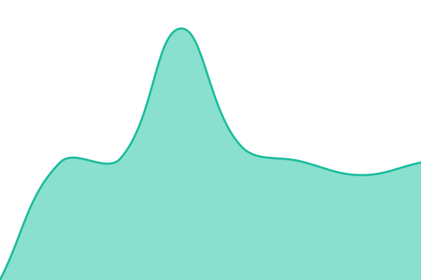
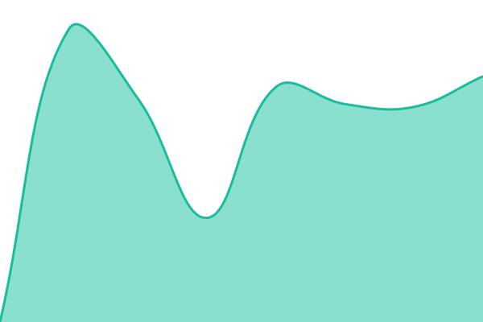

# [📈 Live Status](https://demo.upptime.js.org): <!--live status--> **🟧 Partial outage**

This repository contains the open-source uptime monitor and status page for [Vale](https://demo.upptime.js.org), powered by [Upptime](https://github.com/upptime/upptime).

With [Upptime](https://upptime.js.org), you can get your own unlimited and free uptime monitor and status page, powered entirely by a GitHub repository. We use [Issues](https://github.com/hophuochoanggia/upptime/issues) as incident reports, [Actions](https://github.com/hophuochoanggia/upptime/actions) as uptime monitors, and [Pages](https://demo.upptime.js.org) for the status page.

<!--start: status pages-->
<!-- This summary is generated by Upptime (https://github.com/upptime/upptime) -->
<!-- Do not edit this manually, your changes will be overwritten -->
<!-- prettier-ignore -->
| URL | Status | History | Response Time | Uptime |
| --- | ------ | ------- | ------------- | ------ |
|  [DeLonghi Vietnam](https://delonghi.vn) | 🟩 Up | [de-longhi-vietnam.yml](https://github.com/hophuochoanggia/upptime/commits/HEAD/history/de-longhi-vietnam.yml) | 

 1668ms
     
 | 

<a href="https://demo.upptime.js.org/history/de-longhi-vietnam">100.00%</a>
    

|  [DeLonghi Thailand](https://delonghi.co.th) | 🟩 Up | [de-longhi-thailand.yml](https://github.com/hophuochoanggia/upptime/commits/HEAD/history/de-longhi-thailand.yml) | 

 1957ms
     
 | 

<a href="https://demo.upptime.js.org/history/de-longhi-thailand">100.00%</a>
    

|  [DeLonghi Cambodia](https://kh.delonghi.com) | 🟩 Up | [de-longhi-cambodia.yml](https://github.com/hophuochoanggia/upptime/commits/HEAD/history/de-longhi-cambodia.yml) | 

 1230ms
     
 | 

<a href="https://demo.upptime.js.org/history/de-longhi-cambodia">100.00%</a>
    

|  [DeLonghi Indonesia](https://id.delonghi.com) | 🟩 Up | [de-longhi-indonesia.yml](https://github.com/hophuochoanggia/upptime/commits/HEAD/history/de-longhi-indonesia.yml) | 

 1263ms
     
 | 

<a href="https://demo.upptime.js.org/history/de-longhi-indonesia">100.00%</a>
    

|  [Braun Household Thailand](https://th.braunhousehold.com) | 🟩 Up | [braun-household-thailand.yml](https://github.com/hophuochoanggia/upptime/commits/HEAD/history/braun-household-thailand.yml) | 

 1446ms
     
 | 

<a href="https://demo.upptime.js.org/history/braun-household-thailand">100.00%</a>
    

|  [Braun Household Vietnam](https://vn.braunhousehold.com) | 🟩 Up | [braun-household-vietnam.yml](https://github.com/hophuochoanggia/upptime/commits/HEAD/history/braun-household-vietnam.yml) | 

 1226ms
     
 | 

<a href="https://demo.upptime.js.org/history/braun-household-vietnam">100.00%</a>
    

|  [Kenwood Thailand](https://th.kenwoodworld.com) | 🟩 Up | [kenwood-thailand.yml](https://github.com/hophuochoanggia/upptime/commits/HEAD/history/kenwood-thailand.yml) | 

 1258ms
     
 | 

<a href="https://demo.upptime.js.org/history/kenwood-thailand">100.00%</a>
    

|  [NutriBullet Singapore](https://nutribullet.sg) | 🟩 Up | [nutri-bullet-singapore.yml](https://github.com/hophuochoanggia/upptime/commits/HEAD/history/nutri-bullet-singapore.yml) | 

 1464ms
     
 | 

<a href="https://demo.upptime.js.org/history/nutri-bullet-singapore">100.00%</a>
    

|  [Eurocham VN](https://eurochamvn.org/) | 🟩 Up | [eurocham-vn.yml](https://github.com/hophuochoanggia/upptime/commits/HEAD/history/eurocham-vn.yml) | 

 2935ms
     
 | 

<a href="https://demo.upptime.js.org/history/eurocham-vn">97.14%</a>
    

|  [Eurocham CA](https://eurocham-cambodia.org/) | 🟥 Down | [eurocham-ca.yml](https://github.com/hophuochoanggia/upptime/commits/HEAD/history/eurocham-ca.yml) | 

 1795ms
     
 | 

<a href="https://demo.upptime.js.org/history/eurocham-ca">88.14%</a>
    

<!--end: status pages-->

[**Visit our status website →**](https://demo.upptime.js.org)

## 📄 License

- Powered by: [Upptime](https://github.com/upptime/upptime)
- Code: [MIT](./LICENSE) © [Anand Chowdhary](https://anandchowdhary.com)
- Data in the `./history` directory: [Open Database License](https://opendatacommons.org/licenses/odbl/1-0/)
